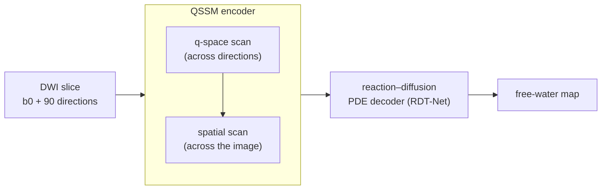

# QSSM: architecture overview

> This is a **high-level overview** for the public release. Implementation details
> (layer configuration, scan ordering, readout and training recipe) are withheld until
> publication. See [WITHHELD.md](../WITHHELD.md).

## Motivation

In the two-compartment free-water model, a diffusion-weighted signal is a mixture of a
tissue compartment and an isotropic free-water compartment:

$$\frac{S(b,\mathbf g)}{S_0} = (1-f)\,S_t(b,\mathbf g) + f\,e^{-b D_{fw}}$$

The free-water term is the same in every gradient direction; the tissue term is not.
The information that separates the two is therefore spread across **q-space**, the set
of diffusion-encoding directions, rather than across image space alone.

Transformer encoders for this task compress all gradient directions in their first layer,
so they never model the angular structure explicitly. QSSM adds an encoder path that does.

## Idea

QSSM is a **state-space (Mamba-style) encoder** with two scanning operators:

- a **q-space scan**, which runs across the gradient directions of each voxel along an
  ordering derived from the acquisition's gradient geometry;
- a **spatial scan**, which takes the place of self-attention across the image.

The encoder feeds the same **reaction–diffusion PDE decoder** used by RDT-Net, so the only
thing that changes relative to the baseline is how the diffusion signal is encoded.

## Study design: a 2×2 encoder factorial

To attribute any gain to the right component, the encoder is varied along two factors.
Everything else is held fixed: data, decoder, loss, optimiser, schedule and seed.

|  | no q-space scan | q-space scan |
|---|---|---|
| **attention** | A0: ViT baseline (RDT-Net) | A1: hybrid |
| **spatial scan** | A2: scan only | **A3: QSSM** |

| Arm | Parameters | vs A0 |
|---|---:|---:|
| A0 | 509,383 | — |
| A1 | 513,591 | +0.8% |
| A2 | 408,775 | −19.8% |
| **A3 (QSSM)** | **412,983** | **−18.9%** |

A3 also needs about **12% fewer FLOPs** per slice than A0.

## Evaluation (summary)

Arms are compared per subject on a held-out test cohort, using paired non-parametric
tests with multiple-comparison correction. Beyond accuracy, the evaluation covers
robustness to noise and fewer gradient directions, downstream DTI metrics (FA/MD) after
free-water correction, and white-matter tractography with TractSeg bundle segmentation.
Results will be reported in the manuscript.
