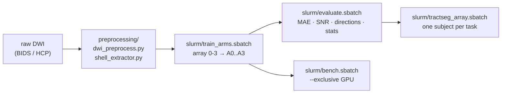

# `hpc/`: preprocessing, SLURM, and adaptive compute

Scripts for running the whole study on a SLURM GPU cluster: raw DWI preprocessing,
the four-arm training sweep, evaluation, benchmarking and tractography as array jobs.
The folder also holds an adaptive-compute controller that decides how many PDE
refinement iterations each input needs.

```
hpc/
├── preprocessing/       raw DWI → model-ready single-shell volumes
├── slurm/               sbatch templates + common.sh (environment, paths, array helpers)
├── adaptive_compute/    SNR-conditioned K-predictor + PPO controller over PDE iterations
└── env/                 build script for the fused mamba-ssm CUDA kernel
```

## Data flow



## `preprocessing/`

| Script | What it does |
|---|---|
| `dwi_preprocess.py` | BIDS AP/PA DWI + T1w → MP-PCA denoising → Gibbs removal → topup/eddy (`dwifslpreproc -rpe_pair`, eddy QC) → N4 bias correction → brain mask → FSL-format export → rigid T1→DWI registration |
| `shell_extractor.py` | multi-shell HCP `data.nii.gz` → `dwi_b0_{1000,2000,3000}.nii.gz` (one b0 + one shell each, with bvals/bvecs) |

Both take `--dry-run` to print the MRtrix3 commands without running them.
`shell_extractor.py --subject ID` processes one subject, which is how the array job calls it.

## `slurm/`

Edit **`common.sh`** once to set your environment activation and `QSSM_DATA_ROOT`. Every
job sources it. Submit from the repository root:

```bash
mkdir -p logs
sbatch hpc/slurm/train_arms.sbatch                                  # 4 arms in parallel (array 0-3)
sbatch --array=3 hpc/slurm/train_arms.sbatch                        # A3 only
sbatch --dependency=afterok:<jobid> hpc/slurm/evaluate.sbatch       # after training
sbatch hpc/slurm/bench.sbatch                                       # exclusive node for timing
N=$(grep -cv '^\s*\(#\|$\)' splits/test.txt)
sbatch --array=1-$N hpc/slurm/tractseg_array.sbatch                 # one subject per task
sbatch --array=1-$N hpc/slurm/preprocess_array.sbatch               # (uses splits/all.txt)
```

| Job | Resources (edit to fit your cluster) |
|---|---|
| `train_arms` | 1 GPU, 8 CPU, 32 GB, 24 h, array 0–3 |
| `evaluate` | 1 GPU, 8 h |
| `bench` | 1 GPU, `--exclusive`, 1 h |
| `tractseg_array` | 1 GPU, 8 CPU, 6 h per subject |
| `preprocess_array` | CPU only, 4 CPU, 2 h per subject |
| `adaptive_compute` | 1 GPU, 24 h |

On MIG-partitioned GPUs, replace `--gres=gpu:1` with a slice (for example
`--gres=mig:20gb:1`) and request `--mem` explicitly. Some clusters default to 8 GB of RAM.

Array jobs look up their subject with `subject_at <split file> $SLURM_ARRAY_TASK_ID`, so
one split file drives every stage.

## `adaptive_compute/`: how many PDE iterations does this input need?

An iterative free-water + tissue (ICVF) estimator whose outer refinement loop is
**variable-length**:

- **`models/predictor.py` (`KPredictor`)**: an MLP on globally pooled ViT features plus
  the input's SNR predicts the number of refinement iterations K (up to 50) for each
  sample. Clean inputs stop early and noisy ones get more passes, so redundant PDE loops
  are skipped.
- **`models/iterative_model.py`**: runs `max(K_pred)` outer iterations of ViT → gated
  refinement → tissue-adaptive PDE blocks → decoder, with deep supervision at every
  iteration.
- **`rl/`**: a PPO agent (`policy.py`, `rl_agent.py`, `reward.py`, `replay_buffer.py`)
  that emits continuous per-iteration actions steering the PDE denoiser. The reward
  combines accuracy, SSIM, edge fidelity and consistency.
- **`data/noise_curriculum.py`**: SNR curricula. The warm-up runs low to moderate noise;
  the RL phase runs a reverse, extreme-to-clean curriculum. `utils/piesno.py` estimates
  SNR at evaluation time.

```bash
cd adaptive_compute
# edit config/default_config.yaml: replace every /path/to/... placeholder
python train_warmup.py                       # supervised warm-up
python train_rl_model.py --config config/default_config.yaml
python evaluate.py --model-path checkpoints/<best>.pth --config config/default_config.yaml
python get_predicted_k.py                    # inspect the K chosen per input
```

[adaptive_compute/ARCHITECTURE.md](adaptive_compute/ARCHITECTURE.md) maps every file.

## `env/build_mamba.sh`

Builds `causal-conv1d` + `mamba-ssm` from source when no wheel matches your
torch/CUDA/GPU, then runs the kernel self-test. See [INSTALL.md](../INSTALL.md).
