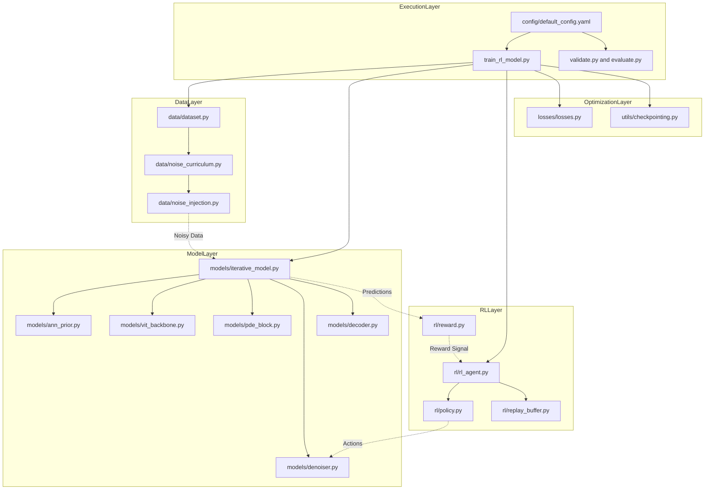
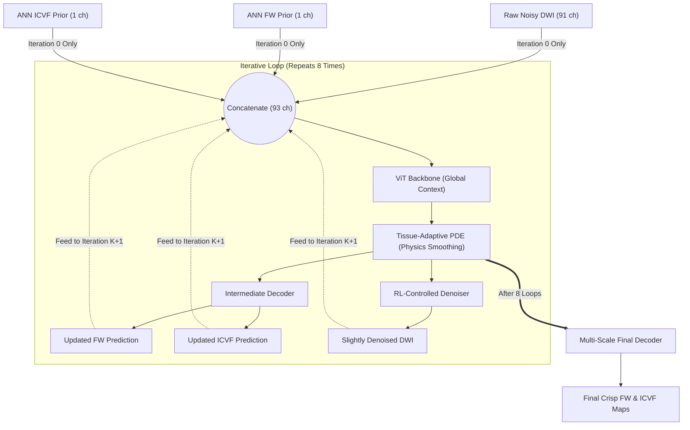
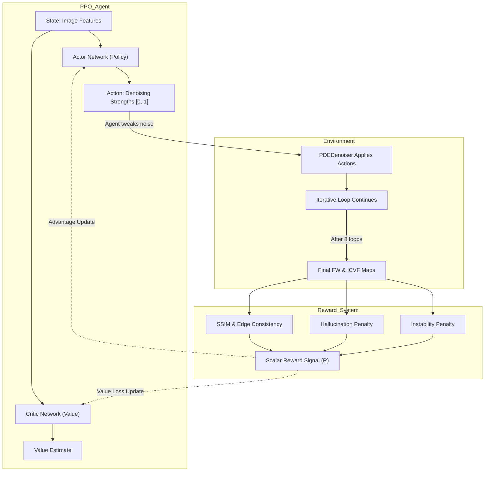

# Codebase Architecture & File Connectivity

Here is a visual map of how all the files in your repository connect to form the complete training and inference pipeline:

## Detailed File-by-File Breakdown & Usage

### 1. Execution Scripts (Entry Points)
These are the files you run directly from your terminal using `python <filename>`.

*   **`train_rl_model.py`**
    *   **What happens:** This is the master loop. It initializes the PyTorch neural network (`IterativeRLModel`), the PPO Reinforcement Learning Agent, and the dataloaders. It loops over epochs, runs forward passes, computes rewards, updates the RL policy, and saves checkpoints.
    *   **How to use it:** `python train_rl_model.py` (Run this when you want to train the full physics-informed RL pipeline).
*   **`train_warmup.py`**
    *   **What happens:** Runs the same model but *disables* the RL agent. It trains the neural network using standard supervised losses (MAE) to give the network a solid foundational understanding of brain anatomy before the RL agent is allowed to start tweaking things.
    *   **How to use it:** `python train_warmup.py` (Run this first on a new dataset).
*   **`validate.py` & `evaluate.py`**
    *   **What happens:** Loads a saved `.pth` checkpoint and runs it on the unseen test dataset. It calculates metrics (like FW MAE, ICVF consistency) and does not calculate gradients or update weights.
    *   **How to use it:** `python validate.py` (Run this to see how well a trained model performs).
*   **`config/default_config.yaml`**
    *   **What happens:** Holds every hyperparameter (learning rates, batch size, noise levels, network depth). 
    *   **How to use it:** Edit this file directly in VS Code to tweak parameters before starting a training run.

### 2. Data Layer (`data/`)
These files run implicitly when `train_rl_model.py` requests data.

*   **`data/dataset.py`**
    *   **What happens:** Subclasses `torch.utils.data.Dataset`. It reads the raw `.nii.gz` or `.h5` files from the hard drive, normalizes the signals, and yields dictionaries containing `dwi`, `fw_gt`, `icvf_gt`, and `tissue_masks`.
*   **`data/noise_curriculum.py`**
    *   **What happens:** Takes the current epoch number and decides the target SNR. For example, it might dictate SNR=0 for epochs 1-10 (extreme noise), and gradually increase it to SNR=100 by epoch 50.
*   **`data/noise_injection.py`**
    *   **What happens:** Contains the mathematical Rician noise physics. It takes the clean DWI slice and the SNR from the curriculum, calculates the exact standard deviation ($\sigma$) required, and corrupts the signal.
*   **`data/synthetic_generator.py`**
    *   **What happens:** A standalone utility that creates fake geometric "phantoms" (circles, squares) to test if the model's PDE logic works in a controlled environment without real brain complexity.
    *   **How to use it:** `python data/synthetic_generator.py` (Run to generate test datasets).

### 3. Model Layer (`models/`)
These files execute during the `model.forward()` pass.

*   **`models/iterative_model.py`**
    *   **What happens:** The conductor of the forward pass. It loops $K$ times (e.g., 8 iterations). It feeds data into the ViT, passes that to the PDE block, gets an intermediate prediction, applies the denoiser, and repeats.
*   **`models/ann_prior.py`**
    *   **What happens:** A simple Multi-Layer Perceptron (MLP) that looks at a single voxel's 91 diffusion directions and makes a rough guess of what the FW and ICVF should be, completely ignoring surrounding neighboring pixels.
*   **`models/vit_backbone.py`**
    *   **What happens:** A Vision Transformer (`SimpleViT`). It cuts the image into patches and uses self-attention to understand the global structure of the brain slice (e.g., "this is the corpus callosum").
*   **`models/pde_block.py`**
    *   **What happens:** Implements differential equations. It takes the features and diffuses (smoothes) them. Crucially, it reads the `tissue_masks` so it *stops* smoothing when it hits the boundary between White Matter and CSF, preserving sharp anatomical edges.
*   **`models/denoiser.py`**
    *   **What happens:** Takes the raw, noisy DWI signal and cleans it slightly between iterations. The strength of this cleaning is dictated entirely by the RL agent.
*   **`models/decoder.py`**
    *   **What happens:** Takes all the processed features from all 8 iterations and projects them down into the final 2D images (the FW and ICVF maps).

#### The Iterative Feedback Loop (Visualized)
This diagram shows how the model feeds its own predictions back into itself across the 8 loops inside `iterative_model.py`.

### 4. Reinforcement Learning Layer (`rl/`)
Executes alongside the model to optimize decision-making.

*   **`rl/rl_agent.py` (PPOAgent)**
    *   **What happens:** The master RL algorithm. It collects the states (image features), actions (denoising strengths), and rewards. Once it collects enough, it runs the PPO (Proximal Policy Optimization) math to update the Policy networks.
*   **`rl/policy.py`**
    *   **What happens:** Contains two neural networks: 
        1. **Actor**: Looks at the image and outputs an action (e.g., "Apply 0.5 denoising strength").
        2. **Critic**: Looks at the image and guesses how much reward the model will get.
*   **`rl/reward.py`**
    *   **What happens:** Evaluates the model's final prediction. It calculates SSIM (structural similarity), penalizes blurry edges, and severely penalizes "hallucinations" (predicting structures that don't exist in the ground truth). It returns a single float score (e.g., +4.2).
*   **`rl/replay_buffer.py`**
    *   **What happens:** A simple list/array that holds the history of what happened in the last batch so `rl_agent.py` can train on it.

#### PPO Action & Reward System (Visualized)
This diagram shows the explicit interaction between the Reinforcement Learning agent, the environment (Iterative Model), and the Reward function.

### 5. Optimization & Utilities
*   **`losses/losses.py`**
    *   **What happens:** Standard PyTorch math (like Mean Absolute Error) used to train the non-RL parts of the model (ViT, decoder, etc.).
*   **`utils/visualization.py`**
    *   **What happens:** Code that draws `matplotlib` figures and saves them as PNGs to your hard drive so you can visually see the training progress.
*   **`utils/checkpointing.py`**
    *   **What happens:** Saves `best_model.pth` to your hard drive.
