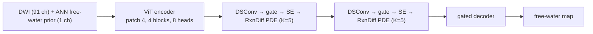

# `rdtnet_baseline/`: RDT-Net (ViT + reaction–diffusion PDE)

RDT-Net is the predecessor QSSM is built from: a hybrid **Vision Transformer** encoder
feeding a **reaction–diffusion PDE** decoder that estimates free-water fraction from
diffusion MRI.



## How it relates to QSSM

- The PDE decoder in `qssm/models/` (`global_layer_rxn_diff.py`, `building_blocks.py`,
  `pde_block.py`) **is** RDT-Net's decoder. This trainer imports it from there.
- **Arm A0** of the QSSM factorial is RDT-Net's architecture trained on the 91-channel
  real + synthetic corpus. **A1–A3** keep this decoder and change only the encoder.
- The RDT-Net checkpoint is the warm start for all four arms (`$QSSM_WARM_START`).

## Two-stage design

1. **Stage I: ANN prior.** A voxel-wise MLP predicts a coarse free-water map from the DWI
   signal. Its output is appended as input channel 92. Priors are read from
   `$QSSM_PRIOR_ROOT`.
2. **Stage II: RDT-Net.** The ViT + PDE network refines that prior into the final map.
   Each PDE block integrates `∂h/∂t = D∇²h + αh − βh² + γf` for K explicit steps, which
   regularises the map spatially.

## Training

```bash
export QSSM_DATA_ROOT=/path/to/data          # see docs/data_layout.md
python train_rxn_diff.py
```

| Input | Location |
|---|---|
| DWI | `$QSSM_TRAIN_SIGNAL/<sid>/T1w/Diffusion/dwi_b0_{1000,2000,3000}.nii.gz` (one shell picked per subject) |
| Mask | `$QSSM_TRAIN_SIGNAL/<sid>/T1w/Diffusion/nodif_brain_mask.nii.gz` |
| Ground truth | `$QSSM_TRAIN_GT/<sid>/free_water_volume.nii.gz` |
| ANN prior | `$QSSM_PRIOR_ROOT/<sid>/predicted_fw_volume_fraction.nii.gz` |

- b0 is fixed at index 0, and 90 diffusion volumes are sampled reproducibly per subject.
  The sampled indices are logged to `sampled_indices_per_subject.json`.
- Loss: MAE + Sobel edge loss. Optimiser: AdamW.
- The best checkpoint goes to `$QSSM_CKPT_DIR/VIT_pde_K5_Rxn_diff.pth`.

Evaluate it with the same code as the QSSM arms:

```bash
python ../qssm/evaluate/evaluate.py --checkpoint $QSSM_CKPT_DIR/VIT_pde_K5_Rxn_diff.pth --label RDT_NET_baseline
```
