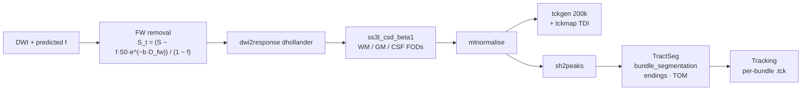

# `tractography/`: free-water-corrected tractography and bundle segmentation

This is the downstream use of a predicted free-water map: remove the free-water signal,
estimate fibre orientation distributions (FODs), run tractography, and segment
white-matter bundles automatically with **TractSeg** (72 bundles).

Two independent pipelines:

| Pipeline | FOD model | Bundle segmentation | Use it for |
|---|---|---|---|
| [ss3t_tractseg/](ss3t_tractseg) | single-shell 3-tissue CSD (MRtrix3Tissue) | **TractSeg** bundles, endings, TOMs + tract-wise tracking | bundle-level analysis |
| [csd_pipeline/](csd_pipeline) | single-tissue CSD (MRtrix3) | — (whole-brain streamlines + TDI) | fast, per-variant comparison of tractograms |

## `ss3t_tractseg/run_fw_tractseg.sh`



```bash
export DWI_BASE=/path/to/Signal            # <sid>/T1w/Diffusion/dwi_b0_1000.nii.gz, bvals_b0_1000, bvecs_b0_1000
export FW_BASE=$QSSM_RESULTS_DIR/eval/A3_pure   # <sid>/predicted_free_water_volume.nii.gz (evaluate.py --save-maps)
export RESULTS_BASE=/path/to/tractography_out
bash ss3t_tractseg/run_fw_tractseg.sh SUBJ01 SUBJ02    # or no args: every ID in splits/test.txt
```

| Setting | Value |
|---|---|
| b | 1000 s/mm² |
| D_fw | 3 × 10⁻³ mm²/s |
| free-water threshold | voxels with f > 0.7 excluded |
| tckgen | cutoff 0.04, angle 45°, length 10–250 mm, 200k streamlines selected |
| TractSeg tracking | 5,000 fibres per bundle |

Tools (`MRTRIX_BIN`, `SS3T_BIN`, `TRACTSEG_BIN`) default to whatever is on `PATH`.
`ss3t_csd_beta1` needs Python ≤ 3.11 (`PY310=...`). The script resumes: a subject whose
`bundle_segmentation/stats/bundle_statistics.csv` exists is skipped. Each subject gets a
log in `$RESULTS_BASE/pipeline_logs/`.

On SLURM: `hpc/slurm/tractseg_array.sbatch`, one subject per array task.

## `csd_pipeline/`

| File | Role |
|---|---|
| `paths.py` | every location comes from an environment variable (`SIGNAL_ROOT`, `MASK_ROOT`, `FW_PRED_ROOT`, `TRACT_OUT`, `MRTRIX_BIN`, `SUBJECTS_FILE`) |
| `fw_correction.py` | voxel-wise free-water signal removal with the predicted map |
| `mrtrix_ops.py` | thin, timed wrappers: `dwi2response tournier`, `dwi2fod csd`, `tckgen`, `tckmap`, `tckstats` |
| `run_subject.py` | original vs free-water-corrected DWI → FOD → streamlines → TDI → metrics JSON |
| `run_batch.py` | all subjects, optionally in parallel |

```bash
cd csd_pipeline
export SIGNAL_ROOT=... MASK_ROOT=... FW_PRED_ROOT=... TRACT_OUT=...
python run_batch.py --parallel 4 --nthreads 8
```

It uses a fixed seed-*attempt* budget (`-select 0 -seeds N`), so streamline counts can be
compared across variants.
